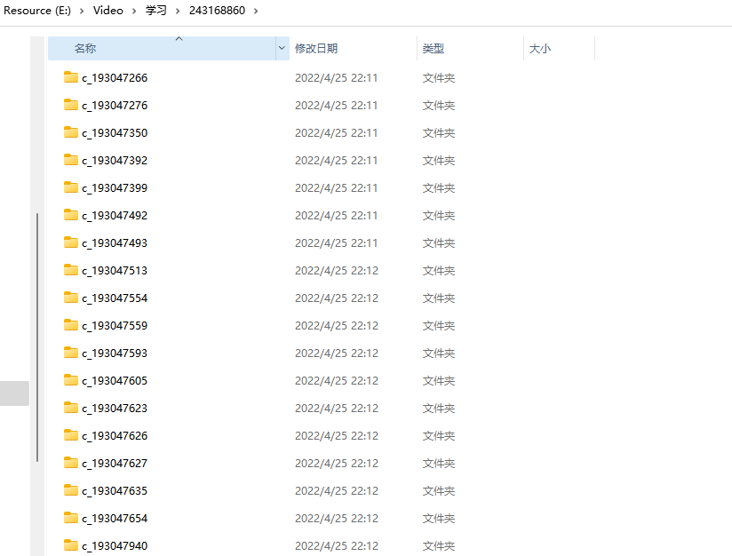
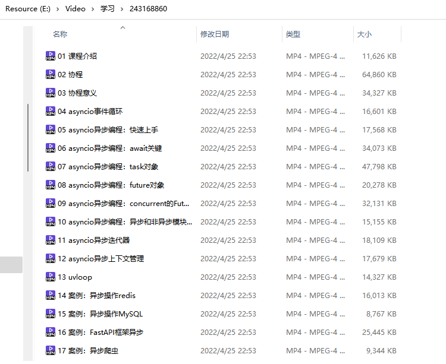

- [beautify_bilibili_foler](#beautify_bilibili_foler)
  - [环境依赖](#环境依赖)
  - [如何使用](#如何使用)
    - [处理前](#处理前)
    - [使用方法](#使用方法)
    - [处理完成后](#处理完成后)

# beautify_bilibili_foler

在 bilibili APP 下载的视频，在电脑上无法直接进行播放，**音视频是分开的**，而且合集视频散落在各个子文件夹下，不好管理。这个工具，就是解决这些问题的，把目录下的音视频整合，输出到一个目录下。

## 环境依赖

- `python`

- `ffmpeg`

    ```sh
    $sudo apt install ffmpeg
    ```

## 如何使用

### 处理前

手机上 bilibili 视频的存放位置在 `/Android/data/tv.danmaku.bili/download` 下，把这些问价你拖到电脑上；

目录结构如下：

```sh
$tree 243168860/                  =====> 缓存下来的视频文件夹

243168860/
├── c_193047266                   =====> 某一集的视频目录
│   ├── 80
│   │   ├── audio.m4s             =====> 音频文件
│   │   ├── index.json
│   │   └── video.m4s             =====> 视频文件
│   ├── danmaku.xml               =====> 弹幕文件
│   └── entry.json                =====> 入口文件（记录视频信息）
└── c_193047940
    ├── 80
    │   ├── audio.m4s
    │   ├── index.json
    │   └── video.m4s
    ├── danmaku.xml
    └── entry.json
```



### 使用方法

**输出帮助信息**

```sh
$python beautify_bilibili_folder.py --help

usage:
    python beautify_bilibili_folder.py /path/to/your/folder
    script will auto find the video and handler it.

    -p or --path=  path to your bilibili download folder
    -c or --clean= if clean old files.
    -h or --help   show this message
```

**开始处理**

```sh
$python beautify_bilibili_folder.py --path /mnt/e/Video/243168860/
/mnt/e/Video/243168860/
/mnt/e/Video/243168860/
===== video_path: [/mnt/e/Video/243168860/c_193047266/80] =====
===== video_tile: [05 asyncio异步编程：快速上手] =====
========================

ffmpeg version 4.2.4-1ubuntu0.1 Copyright (c) 2000-2020 the FFmpeg developers
  built with gcc 9 (Ubuntu 9.3.0-10ubuntu2)

  ... 省略一堆 ffmpeg 的日志

```

### 处理完成后


